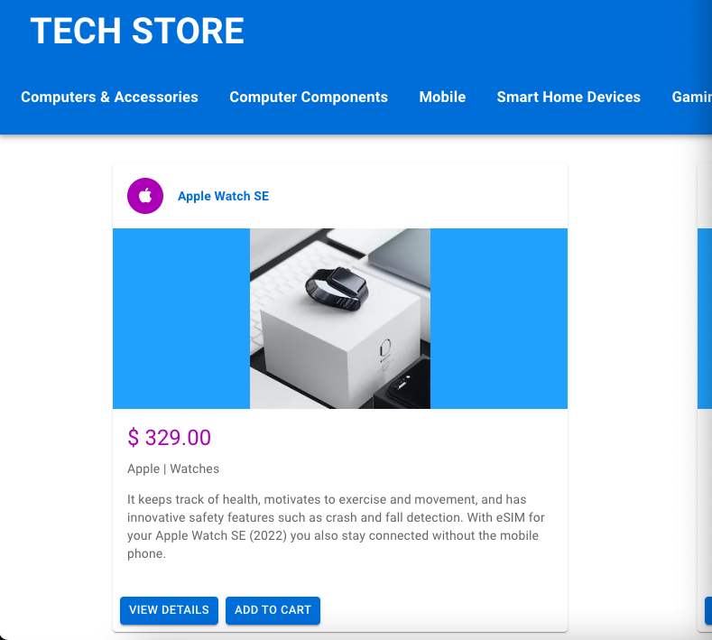

# Tech Store

## User Interface

---

## Description

This is a full stack e-commerce store built with .NET Web API, C# and React. 
The application allows for customer account registration and passwords are hashed. Customers can log in and filter, sort and search for products, add products to basket, modify basket, place orders and pay for them with Stripe. Administrators can log in and add, delete and modify products in the product system with details and image. Functionalities include cookie storage, role based security, light / darkmode and other things.

The goal was to learn basic concepts of .NET Web API, React / Typescript and get a clear understanding of the achitecture of a full stack .NET e-commerce store size application as well as the security implementations and payment processing functionalities required in such applications.

---

## Technologies used:

- .NET Web API 
- C#
- Entity Framework
- ASP.NET Identity
- Stripe 
- SQLite
- React
- TypeScript
- Material UI
- Dotnet CLI
